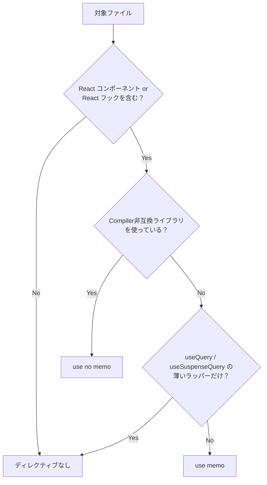
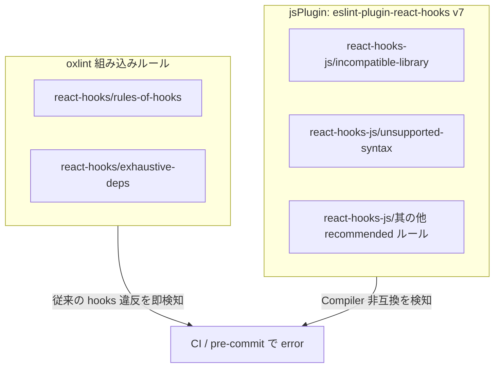

## はじめに

こんにちは。ぷーじ（[@yug1224](https://x.com/yug1224)）です。

8,700超のファイルを抱えるTypeScript monorepoにReact Compilerを入れたい。最初は `"all"` モードで気軽に試してみたのですが、TanStack Table周りのテーブルが軒並み壊れ、react-hook-formのバリデーションが無限ループに陥りました。正直、全ファイル一括は無謀だったと悟り、**`compilationMode: "annotation"`**（annotationモード）でファイル単位のオプトインに切り替えることにしました。

さらに、oxlintの組み込みhooksルールと `eslint-plugin-react-hooks` v7をjsPluginとして読み込むことで、Compilerが想定しない書き方をlint段階で検知できるようにしています。

lint段階で検出されたCompiler非互換のコードは約294件。ただしライブラリ由来は約5%（TanStack Table v8の15ファイル）で、残りは自前コードのパターン修正で解消できるものでした。

この記事では、annotationモードの設定方法、`"use memo"` / `"use no memo"` の判断基準、oxlintでのlint戦略、そして8,000超ファイルへの段階適用戦略をまとめます。

## annotationモードとは

React Compilerには3つの `compilationMode` があります。

| モード                | 挙動                                                              |
| --------------------- | ----------------------------------------------------------------- |
| `"all"`（デフォルト） | すべてのコンポーネント・フックをコンパイル対象にする              |
| `"annotation"`        | `"use memo"` ディレクティブがあるファイルのみコンパイル対象にする |
| `"infer"`             | Compiler が安全と推論したものだけコンパイルする                   |

`"infer"` モードはCompilerの推論に任せる形になりますが、ファイル単位で明示的に制御できないため段階適用との相性が悪く、今回は採用しませんでした。

annotationモードでは、ファイル先頭に **`"use memo";`** を書いたファイルだけがCompilerの最適化対象になります。逆に **`"use no memo";`** を書くと、明示的にコンパイル対象から除外できます。

```ts
// react-compiler.config.ts
export const ReactCompilerConfig = {
  target: "18",
  compilationMode: "annotation",
} as const;
```

`target: "18"` は React 18 環境向けにコンパイルすることを指定しています。React 19 へのアップグレード前でも Compiler の恩恵を受けられるのは嬉しいですね。

## Viteへの組み込み

Viteプロジェクトでは `vite-plugin-babel` を経由して `babel-plugin-react-compiler` を適用します。

```ts
// vite.config.ts（該当部分の抜粋）
import babel from "vite-plugin-babel";
import { ReactCompilerConfig } from "./react-compiler.config";

export default defineConfig({
  plugins: [
    babel({
      filter: /\.[jt]sx?$/,
      babelConfig: {
        plugins: [["babel-plugin-react-compiler", ReactCompilerConfig]],
      },
    }),
    // ... other plugins
  ],
});
```

ポイントは `filter` で `.tsx` だけでなく `.ts` も対象にしている点です。カスタムフックは `.ts` で書かれることもあるため、拡張子で漏れないようにしています。

## `"use memo"` / `"use no memo"` の判断基準

annotationモードの運用で最も重要なのは、どのファイルにどのディレクティブを付けるかの判断基準を明確にすることです。



### `"use memo";` を付けるファイル

| 対象                                                  | 理由                                         |
| ----------------------------------------------------- | -------------------------------------------- |
| React コンポーネント（`.tsx`）                        | Compiler のメモ化最適化の主要ターゲット      |
| JSX を返す / React の状態・副作用を扱うカスタムフック | `useMemo` / `useCallback` 相当の最適化が効く |

### ディレクティブを付けないファイル

| 対象                                                         | 理由                                                     |
| ------------------------------------------------------------ | -------------------------------------------------------- |
| 型定義のみのファイル                                         | コンパイル対象になるコードがない                         |
| 純粋関数ユーティリティ                                       | Reactのフックを使わないためCompilerの対象外              |
| Queryフックの薄いラッパー（`useQuery` / `useSuspenseQuery`） | TanStack Queryがメモ化を管理しておりCompilerの介入は不要 |
| 定数・設定ファイル                                           | ランタイムでReactの仕組みを使わない                      |

### `"use no memo";` を付けるファイル

一部のライブラリは React Compiler と互換性がありません。これらを使うファイルでは `"use no memo";` で明示的にオプトアウトします。

| ライブラリ                           | 理由                                                       |
| ------------------------------------ | ---------------------------------------------------------- |
| `useReactTable`（TanStack Table v8） | カラム定義の変更がテーブルに反映されず、ソートやフィルタが無応答になる |
| `react-hook-form`                    | バリデーション発火時に無限ループが発生する                            |
| `useInfiniteQuery`（TanStack Query） | 次ページ取得パラメータがメモ化で固定され、追加読み込みが止まる       |

`"use no memo";` を付けたファイルでも、Compiler由来のlintルールは引き続き発火します。違反箇所には **違反行の直前に** `// oxlint-disable-next-line react-hooks-js/<rule>` を付けて抑制します。ファイル先頭でルールを列挙する方式は禁止しています。

## oxlintでのlint戦略

Compiler導入の初期に痛感したのは、従来の `rules-of-hooks` / `exhaustive-deps` だけではCompiler非互換のコードをすり抜けてしまうことでした。React公式の `eslint-plugin-react-hooks` v7にはCompiler由来の検出ルール（`incompatible-library` / `unsupported-syntax` 等）が統合されており、これをoxlintのjsPluginとして読み込むことで、CIが通ったのにランタイムで壊れる事故を防いでいます。具体的には、oxlintで2系統のhooksルールを運用しています。

### アーキテクチャ



### 役割分担

| 系統            | プレフィックス     | 役割                                                                                                                                                   |
| --------------- | ------------------ | ------------------------------------------------------------------------------------------------------------------------------------------------------ |
| oxlint 組み込み | `react-hooks/*`    | `rules-of-hooks` と `exhaustive-deps` — 従来どおりのhooksルール違反を検知                                                                              |
| jsPlugin        | `react-hooks-js/*` | `eslint-plugin-react-hooks` v7のrecommendedルールのうち、組み込みと重複しないもの。Compiler由来の `incompatible-library` / `unsupported-syntax` を含む |

### oxlint.config.ts の実装

```ts
import reactHooks from "eslint-plugin-react-hooks";
import { defineConfig } from "oxlint";

const BUILTIN_RULES = new Set(["rules-of-hooks", "exhaustive-deps"]);

const reactHooksJsRules = Object.fromEntries(
  Object.entries(reactHooks.configs.recommended.rules)
    .filter(([key]) => !BUILTIN_RULES.has(key.replace("react-hooks/", "")))
    .map(([key, severity]) => [key.replace("react-hooks/", "react-hooks-js/"), severity]),
);

export default defineConfig({
  options: {
    reportUnusedDisableDirectives: "error",
  },
  jsPlugins: [{ name: "react-hooks-js", specifier: "eslint-plugin-react-hooks" }],
  rules: {
    "react-hooks/rules-of-hooks": "error",
    "react-hooks/exhaustive-deps": "error",
    ...reactHooksJsRules,
  },
});
```

組み込みの `rules-of-hooks` / `exhaustive-deps` は `BUILTIN_RULES` として除外し、jsPlugin側では `react-hooks-js/*` プレフィックスに付け替えています。これにより、同じルールが二重に発火することを避けつつ、Compiler固有のルールだけをjsPlugin側で捕捉できます。

`reportUnusedDisableDirectives: "error"` により、不要になった `oxlint-disable` コメントが残っているとerrorになります。Compiler対応が進んで抑制が不要になったとき、コメントの消し忘れを防げるのは地味にありがたいですね。

## 8,000+ファイルへの段階適用戦略

### Phase 1: 準備 — 安全な境界の確立

最初にやったのは `"use memo";` を付けることではなく、**付けてはいけないファイルを明確にすること**でした。TanStack Table v8・react-hook-form・useInfiniteQuery等の非互換ライブラリを使う75ファイルに `"use no memo";` を一括付与し、Compilerの対象外であることを明示しました。並行して、`window.location.hash` の直接書き換えのような非互換パターンをユーティリティ関数に抽出するリファクタリングも実施しています。

さらに、oxlintのCompiler由来ルールをerror化し、CIで非互換コードを確実に検知する体制を整えました。この準備があることで、以降のPhaseで `"use memo";` を付けたときに「CIが通れば安全」と言い切れるようになります。

### Phase 2: 漸進的対応 — `"use memo"` の拡大（現在ここ）

新規作成するコンポーネント・フックにはすべて `"use memo";` を付ける運用をチームで合意しました。AGENTS.mdにルールを明記し、AIエージェント（Cursor / Claude Code）も同じ基準で自動付与するようにしています。最初の2週間で新規ファイル約40件に適用しましたが、Compiler起因のトラブルはゼロでした。

加えて、リファクタリングや機能追加のタイミングで、触った既存ファイルにも `"use memo";` を付与しています。`pnpm lint` を実行し、Compiler由来のlintエラーが出たら修正するか `"use no memo";` にフォールバックします。正直、想定外だったのはreact-hook-form周りです。最初は「フォームがあるページだけでしょ」と思っていたのですが、バリデーションロジックを共通化しているファイルを芋づる式に `"use no memo";` にする羽目になりました。判断基準テーブルはこのPhaseだけで3回書き直しています。

### Phase 3: 将来 — `"all"` モードへの移行

安定した領域（ユーティリティ、共通コンポーネント等）からcodemodで `"use memo";` を一括付与し、CIで回帰を検証します。`"use no memo";` のファイルが十分に減ったタイミングで `compilationMode` を `"all"` に切り替え、`"use no memo";` だけをオプトアウトとして残す予定です。

:::message
Phase 3は今後の計画であり、本記事執筆時点ではPhase 2を進行中です。
:::

## ハマりどころとTips

### 抑制はnext-lineのみ

`"use no memo";` を付けたファイルでCompilerルールが発火した場合、抑制コメントは **違反行の直前の 1 行** にのみ書きます。

```tsx
"use no memo";

// oxlint-disable-next-line react-hooks-js/incompatible-library
const table = useReactTable(options);
```

最初はファイル先頭で一括suppressしていましたが、ファイルを開いても「どの行が本当に違反しているのか」が分からず、修正時の判断ができなくなりました。行単位の `oxlint-disable-next-line` に切り替えてからは、修正対象が明確になり、Compiler対応が進んで抑制が不要になったときもすぐに気づけるようになっています。地味に引っかかりやすいポイントなので、チーム内で最初に共有しておくと良いと思います。

### stories / form-factoryのoverrides

Storybookのstoriesファイルやform-factoryパターンのファイルでは、hooksのルール自体をオフにしています。hooksを通常とは異なる文脈で使うケースがあるためです。

```ts
// oxlint.config.ts overrides 抜粋
overrides: [
  {
    files: ["**/*.stories.tsx", "**/*.stories.ts"],
    rules: { "react-hooks/rules-of-hooks": "off" },
  },
  {
    files: ["**/form-factory/**/*.tsx"],
    rules: { "react-hooks/rules-of-hooks": "off" },
  },
],
```

### `reportUnusedDisableDirectives` の活用

Compiler対応を進めていくと、以前は必要だった `oxlint-disable-next-line` が不要になるケースが出てきます。`reportUnusedDisableDirectives: "error"` を設定しておけば、不要な抑制コメントがCIで検出されます。コードの衛生状態を保つうえで重要な設定です。

## まとめ

大規模プロジェクトでReact Compilerを安全に導入するための戦略を整理しました。

1. **annotation モード** でファイル単位のオプトインにすることで、全適用時のリスクを回避する
2. **`"use memo"` / `"use no memo"` の判断基準** を明文化し、チーム全体（AIエージェント含む）で一貫した運用を実現する
3. **oxlint の2系統運用**（組み込み `react-hooks/*` + jsPlugin `react-hooks-js/*`）で、従来のhooks違反とCompiler非互換の両方をlint段階で検知する
4. **段階適用**（準備→漸進的対応→全適用）で、8,000超ファイルへの展開を安全に進める

最終的なゴールは `compilationMode: "all"` への移行ですが、annotationモードでの漸進的導入により、プロダクションの安定性を保ちながらCompilerの恩恵を得られています。

同じように大規模プロジェクトでReact Compilerの導入を検討している方の参考になれば嬉しいです。感想や「うちではこうやった」という話があれば、ぜひX（[@yug1224](https://x.com/yug1224)）まで気軽に教えてください！
