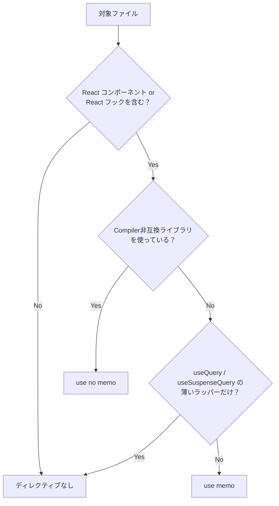
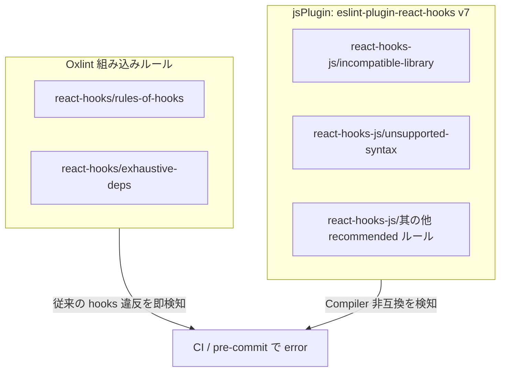

_React CompilerをannotationモードとOxlintで安全に導入する_

## はじめに

こんにちは。ぷーじ（[@yug1224](https://x.com/yug1224)）です。

Dress Codeフロントエンドでは、約7,500のファイルを抱えるTypeScript monorepoで開発しています。このmonorepoにReact Compilerを導入するにあたり、最初はローカルで `"all"` モードを気軽に試してみたのですが、TanStack Table v8を使ったテーブルが軒並み壊れ、react-hook-formのフォームが無限ループに突入し、画面が真っ白になるページも出てきました。全ファイル一括は早々に諦め、**`compilationMode: "annotation"`**（annotationモード）でファイル単位のオプトインに切り替えることにしました。

さらに、Oxlintの組み込みhooksルールと `eslint-plugin-react-hooks` v7をjsPluginとして読み込むことで、Compilerが想定しない書き方をlint段階で検知できるようにしています。

OxlintのCompiler由来ルールで検出された非互換コードは数百件に上りましたが、大半は自前コードのパターン修正で解消できるものでした。

この記事では、annotationモードの設定方法、`"use memo"` / `"use no memo"` の判断基準、Oxlintでのlint戦略、そして7,000超ファイルへの段階適用戦略をまとめます。React Hooks・TypeScript monorepo・Viteに馴染みがあり、大規模プロジェクトでReact Compilerを「壊さずに入れたい」と考えている方が主な対象です。

## annotationモードとは

https://ja.react.dev/reference/react-compiler/compilationMode

https://ja.react.dev/learn/react-compiler/incremental-adoption

React Compilerはデフォルトで全コンポーネントを最適化対象にしますが、大規模プロジェクトではそれが問題になることがあります。そこで3つの [`compilationMode`](https://ja.react.dev/reference/react-compiler/compilationMode) が用意されています。

| モード                | 挙動                                                                                      |
| --------------------- | ----------------------------------------------------------------------------------------- |
| `"all"`（デフォルト） | すべてのコンポーネント・フックをコンパイル対象にする                                      |
| `"annotation"`        | `"use memo"` ディレクティブがあるファイル・コンポーネント・フックのみコンパイル対象にする |
| `"infer"`             | Compiler が安全と推論したものだけコンパイルする                                           |

`"infer"` モードはCompilerの推論に任せる形になりますが、ファイル単位で「このファイルは対象外」と明示できないため段階適用との相性が悪く、今回は採用しませんでした。

annotationモードでは、**`"use memo";`** ディレクティブを書いたコンポーネントやフックだけがCompilerの最適化対象になります。ファイル先頭に書けばファイル内の全コンポーネント・フックが対象に、関数の先頭に書けばその関数だけが対象になります。逆に **`"use no memo";`** を書くと、明示的にコンパイル対象から除外できます。

```ts
// react-compiler.config.ts
export const ReactCompilerConfig = {
  target: "18",
  compilationMode: "annotation",
} as const;
```

React Compilerは React 19 で最適に動作しますが、[React 17 および 18 もサポートしています](https://ja.react.dev/learn/react-compiler/installation)。`target` にはプロジェクトの React バージョンを指定します。React 19 未満の環境でも Compiler の恩恵を受けられるのは嬉しいですね。

## Viteへの組み込み

Viteプロジェクトでは `vite-plugin-babel` を経由して `babel-plugin-react-compiler` を適用します。

```ts
// vite.config.ts（該当部分の抜粋）
import babel from "vite-plugin-babel";
import { ReactCompilerConfig } from "./react-compiler.config";

export default defineConfig({
  plugins: [
    babel({
      filter: /\.[jt]sx?$/,
      babelConfig: {
        plugins: [["babel-plugin-react-compiler", ReactCompilerConfig]],
      },
    }),
    // ... other plugins
  ],
});
```

ポイントは `filter` で `.tsx` だけでなく `.ts` も対象にしている点です。カスタムフックは `.ts` で書かれることもあるため、拡張子で漏れないようにしています。

## `"use memo"` / `"use no memo"` の判断基準

annotationモードの運用で最も重要なのは、どのファイルにどのディレクティブを付けるかの判断基準を明確にすることです。



### `"use memo";` を付けるファイル

| 対象                                                  | 理由                                         |
| ----------------------------------------------------- | -------------------------------------------- |
| React コンポーネント（`.tsx`）                        | Compiler のメモ化最適化の主要ターゲット      |
| JSX を返す / React の状態・副作用を扱うカスタムフック | `useMemo` / `useCallback` 相当の最適化が効く |

### ディレクティブを付けないファイル

| 対象                                                         | 理由                                                     |
| ------------------------------------------------------------ | -------------------------------------------------------- |
| 型定義のみのファイル                                         | コンパイル対象になるコードがない                         |
| 純粋関数ユーティリティ                                       | Reactのフックを使わないためCompilerの対象外              |
| Queryフックの薄いラッパー（`useQuery` / `useSuspenseQuery`） | TanStack Queryがメモ化を管理しておりCompilerの介入は不要 |
| 定数・設定ファイル                                           | ランタイムでReactの仕組みを使わない                      |

### `"use no memo";` を付けるファイル

https://github.com/TanStack/table/issues/5567
https://github.com/react-hook-form/react-hook-form/issues/12298

一部のライブラリは React Compiler と互換性がありません。これらを使うファイルでは `"use no memo";` で明示的にオプトアウトします。

| ライブラリ                           | 理由                                                                                                                                           |
| ------------------------------------ | ---------------------------------------------------------------------------------------------------------------------------------------------- |
| `useReactTable`（TanStack Table v8） | カラム定義の変更がテーブルに反映されず、ソートやフィルタが無応答になる（[TanStack/table#5567](https://github.com/TanStack/table/issues/5567)） |
| `react-hook-form`                    | バリデーション発火時に無限ループが発生する（[react-hook-form#12298](https://github.com/react-hook-form/react-hook-form/issues/12298)）         |

`"use no memo";` を付けたファイルでも、Compiler由来のlintルールは引き続き発火します。違反箇所には **違反行の直前に** `// oxlint-disable-next-line react-hooks-js/<rule>` を付けて抑制します。ファイル先頭でルールを列挙する方式は禁止しています。

## Oxlintでのlint戦略

https://oxc.rs/docs/guide/usage/linter/js-plugins

https://react.dev/reference/eslint-plugin-react-hooks

Compiler導入の初期に痛い目を見ました。CIは通っているのに、実際に動かすとテーブルのソートが効かない。原因を追ってみると、Compiler非互換のコードが従来の `rules-of-hooks` / `exhaustive-deps` をすり抜けていたことが分かりました。React公式の [`eslint-plugin-react-hooks`](https://react.dev/reference/eslint-plugin-react-hooks) v7にはCompiler由来の検出ルール（`incompatible-library` / `unsupported-syntax` 等）が統合されており、OxlintにはESLintプラグインをそのまま読み込める[jsPlugin](https://oxc.rs/docs/guide/usage/linter/js-plugins)という仕組みがあるので、これを活用してランタイムで壊れる事故を防いでいます。

具体的には、Oxlintで2系統のhooksルールを運用しています。組み込みルールで従来のhooks違反を、jsPluginでCompiler固有の違反を検知する構成です。

### アーキテクチャ



### 役割分担

| 系統            | プレフィックス     | 役割                                                                                                                                                   |
| --------------- | ------------------ | ------------------------------------------------------------------------------------------------------------------------------------------------------ |
| Oxlint 組み込み | `react-hooks/*`    | `rules-of-hooks` と `exhaustive-deps` — 従来どおりのhooksルール違反を検知                                                                              |
| jsPlugin        | `react-hooks-js/*` | `eslint-plugin-react-hooks` v7のrecommendedルールのうち、組み込みと重複しないもの。Compiler由来の `incompatible-library` / `unsupported-syntax` を含む |

### oxlint.config.ts の実装

[`eslint-plugin-react-hooks` v7のrecommendedルール](https://react.dev/reference/eslint-plugin-react-hooks)は17個に増えており、個別に定義するのは煩雑です。そこで、recommendedの設定オブジェクトからルールを動的に取得し、Oxlint組み込みと重複する `rules-of-hooks` / `exhaustive-deps` を除外したうえで `react-hooks-js/*` プレフィックスに付け替えるテクニックを使っています。プラグインのバージョンアップでルールが追加された場合にも自動追従できるメリットがあります。

```ts
import reactHooks from "eslint-plugin-react-hooks";
import { defineConfig } from "oxlint";

const BUILTIN_RULES = new Set(["rules-of-hooks", "exhaustive-deps"]);

const reactHooksJsRules = Object.fromEntries(
  Object.entries(reactHooks.configs.recommended.rules)
    // 組み込みと重複する rules-of-hooks / exhaustive-deps を除外
    .filter(([key]) => !BUILTIN_RULES.has(key.replace("react-hooks/", "")))
    // プレフィックスを react-hooks-js/* に付け替え
    .map(([key, severity]) => [key.replace("react-hooks/", "react-hooks-js/"), severity]),
);

export default defineConfig({
  options: {
    reportUnusedDisableDirectives: "error",
  },
  jsPlugins: [{ name: "react-hooks-js", specifier: "eslint-plugin-react-hooks" }],
  rules: {
    "react-hooks/rules-of-hooks": "error",
    "react-hooks/exhaustive-deps": "error",
    ...reactHooksJsRules,
  },
});
```

組み込みの `rules-of-hooks` / `exhaustive-deps` は `BUILTIN_RULES` として除外し、jsPlugin側では `react-hooks-js/*` プレフィックスに付け替えています。これにより、同じルールが二重に発火することを避けつつ、Compiler固有のルールだけをjsPlugin側で捕捉できます。

https://oxc.rs/docs/guide/usage/linter/config-file-reference.html#options-reportunuseddisabledirectives

[`reportUnusedDisableDirectives: "error"`](https://oxc.rs/docs/guide/usage/linter/config-file-reference.html#options-reportunuseddisabledirectives) により、不要になった `oxlint-disable` コメントが残っているとerrorになります。Compiler対応が進んで抑制が不要になったとき、コメントの消し忘れを防げるのは地味にありがたいですね。

## 7,000+ファイルへの段階適用戦略

### Phase 1: 準備（安全な境界の確立）

最初にやったのは `"use memo";` を付けることではなく、**付けてはいけないファイルを明確にすること**でした。

Compiler由来ルールで検出された非互換コードは約290件。そのうちライブラリ由来（TanStack Table v8）は15ファイル程度で、残りは自前コードのパターンでした。非互換ライブラリを使うファイルを `rg 'useReactTable|useForm' --files-with-matches` などで洗い出すと75ファイル。「思ったより多いな…」というのが正直な感想です。

これらに `"use no memo";` を一括付与してCompilerの対象外であることを明示し、並行して非互換パターンをユーティリティ関数に抽出するリファクタリングも進めました。

さらに、OxlintのCompiler由来ルールをerror化し、CIで非互換コードを確実に検知する体制を整えました。この準備があることで、以降のPhaseで `"use memo";` を付けたときに、少なくともCompiler由来ルールがカバーする範囲においては「CIが通れば安全」と言い切れるようになります。ただし、ランタイム固有の状態遷移やタイミング依存の問題はlintでは検出できないため、E2Eテストとの併用が前提です。

### Phase 2: 漸進的対応（`"use memo"` の拡大）

新規作成するコンポーネント・フックにはすべて `"use memo";` を付ける運用をチームで合意しました。AGENTS.mdにルールを明記し、AIエージェント（Cursor / Claude Code）も同じ基準で自動付与するようにしています。最初の2週間で新規ファイル約140件に適用しましたが、Compiler起因のトラブルはゼロ。正直、拍子抜けするくらい平和で、annotationモードの「壊れない安心感」がチームに浸透し始めた瞬間でした。

加えて、リファクタリングや機能追加で既存ファイルを触ったら「ついでに `"use memo";` も付けておくか」というノリで付与しています。ボーイスカウトルール（触ったコードは見つけた時より綺麗にして返す）的な運用です。既存ファイルへの適用手順は以下のとおりです。

1. 対象ファイルに `"use memo";` を追加
2. `pnpm run lint` を実行
3. Compiler由来のlintエラーが出たら修正
4. 修正が難しい場合は `"use no memo";` にフォールバック

たとえば、ステップ3で頻出したのは `exhaustive-deps` 違反です。依存配列にオブジェクトをそのまま渡しているケースで、Compilerのメモ化と噛み合わずに警告が出ます。

```diff
- const options = { page, sortKey };
- useEffect(() => { fetchData(options); }, [options]);
+ const options = useMemo(() => ({ page, sortKey }), [page, sortKey]);
+ useEffect(() => { fetchData(options); }, [options]);
```

この `useMemo` の追加はCompiler適用前の準備段階で必要な修正です。Compilerが正しくメモ化を推論できる場合は、最終的にこの手動 `useMemo` も不要になる見込みです。

実際には、まず機械的に対応できるファイルに `"use no memo";` を一括付与し、その後コードを修正しながら `"use no memo";` を `"use memo";` に切り替えていく流れで進めています。react-hook-form周りは対象ファイルが多く、地道な作業になりました。

### Phase 3: 将来（`"all"` モードへの移行）

安定した領域（ユーティリティ、共通コンポーネント等）からcodemod（ASTベースの自動コード変換ツール）で `"use memo";` を一括付与し、CIで回帰を検証します。非互換ライブラリのCompiler対応が進み `"use no memo";` が不要になってきたタイミングで `compilationMode` を `"all"` に切り替え、ディレクティブの管理自体をなくしていく予定です。

:::message
Phase 3は今後の計画です。正直、非互換ライブラリがいつCompiler対応するかは読めていません。本記事執筆時点ではPhase 2を進行中で、肌感覚としては8割方いけそうだと思っていますが、残りの2割が一番厄介かもしれません。
:::

## ハマりどころとTips

### 抑制はnext-lineのみ

`"use no memo";` を付けたファイルでCompilerルールが発火した場合、抑制コメントは **違反行の直前の1行** にのみ書きます。

```tsx
"use no memo";

// oxlint-disable-next-line react-hooks-js/incompatible-library
const table = useReactTable(options);
```

行単位の `oxlint-disable-next-line` にすることで修正対象が明確になり、Compiler対応が進んで抑制が不要になったときもすぐに気づけます。

### 不要になった抑制コメントの検出

前述の `reportUnusedDisableDirectives: "error"` を設定しておけば、Compiler対応が進んで不要になった `oxlint-disable-next-line` をCIが自動で教えてくれます。設定方法は「[Oxlintでのlint戦略](#oxlintでのlint戦略)」セクションを参照してください。

## まとめ

振り返ると、最初にローカルで `"all"` モードを試して盛大に壊したのが結果的によい出発点でした。壊れ方を観察したことで「何を守るべきか」が明確になり、以降の戦略が決まっていきました。

1. **annotation モード** でファイル単位のオプトインにすることで、全適用時のリスクを回避する
2. **`"use memo"` / `"use no memo"` の判断基準** を明文化し、チーム全体（AIエージェント含む）で一貫した運用を実現する
3. **Oxlint の2系統運用**（組み込み `react-hooks/*` + jsPlugin `react-hooks-js/*`）で、従来のhooks違反とCompiler非互換の両方をlint段階で検知する
4. **段階適用**（準備→漸進的対応→全適用）で、7,000超ファイルへの展開を安全に進める

最終的なゴールは `compilationMode: "all"` への移行ですが、annotationモードでの漸進的導入により、プロダクションの安定性を保ちながらCompilerの恩恵を得られています。

同じように大規模プロジェクトでReact Compilerの導入を検討している方の参考になれば嬉しいです。「うちではこうハマった」「この構成でうまくいった」みたいな話、X（[@yug1224](https://x.com/yug1224)）で聞けるととても助かります。
