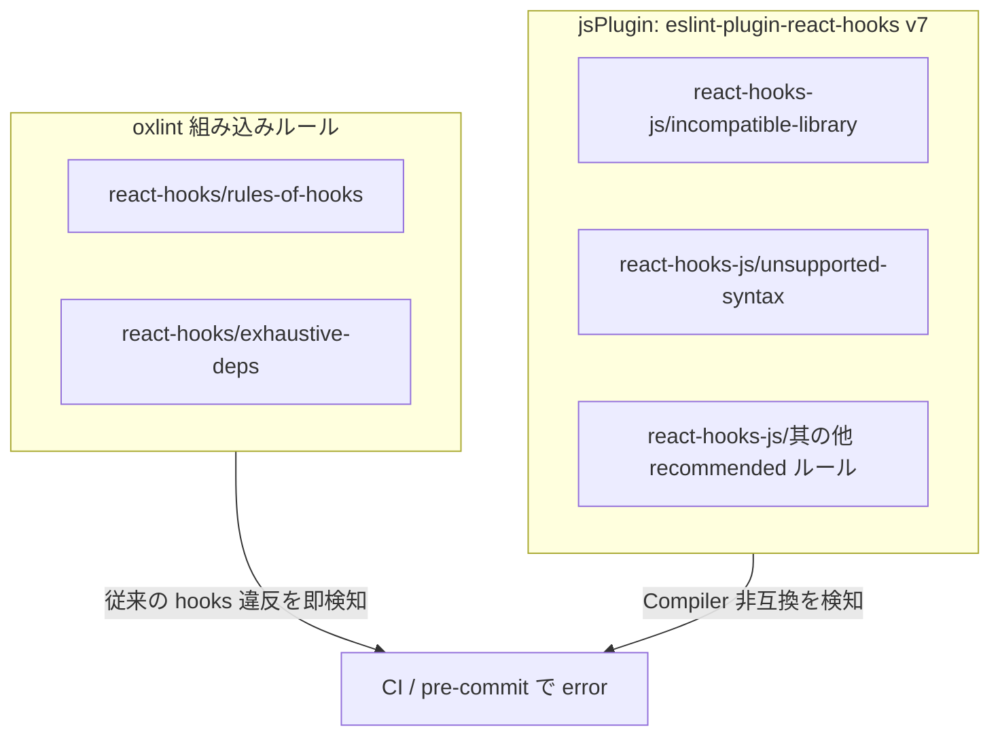

## はじめに

8,700 超のファイルを抱える TypeScript monorepo に React Compiler を入れたい——最初は `"all"` モードで気軽に試してみたが、TanStack Table 周りのテーブルが軒並み壊れ、react-hook-form のバリデーションが無限ループに陥った。全ファイル一括は無謀だと悟り、**`compilationMode: "annotation"`**（annotation モード）でファイル単位のオプトインに切り替えることにした。

さらに、oxlint の組み込み hooks ルールと `eslint-plugin-react-hooks` v7 を jsPlugin として読み込む **二重ガード** を敷くことで、Compiler が想定しない書き方を lint 段階で検知できるようにしている。

この記事では、annotation モードの設定方法、`"use memo"` / `"use no memo"` の判断基準、oxlint による二重ガードの仕組み、そして 8,000 超ファイルへの段階適用戦略をまとめる。

## annotation モードとは

React Compiler には 3 つの `compilationMode` がある。

| モード                | 挙動                                                              |
| --------------------- | ----------------------------------------------------------------- |
| `"all"`（デフォルト） | すべてのコンポーネント・フックをコンパイル対象にする              |
| `"annotation"`        | `"use memo"` ディレクティブがあるファイルのみコンパイル対象にする |
| `"infer"`             | Compiler が安全と推論したものだけコンパイルする                   |

annotation モードでは、ファイル先頭に **`"use memo";`** を書いたファイルだけが Compiler の最適化対象になる。逆に **`"use no memo";`** を書くと、明示的にコンパイル対象から除外できる。

```ts
// react-compiler.config.ts
export const ReactCompilerConfig = {
  target: "18",
  compilationMode: "annotation",
} as const;
```

`target: "18"` は React 18 環境向けにコンパイルすることを指定している。React 19 へのアップグレード前でも Compiler の恩恵を受けられる。

## Vite への組み込み

Vite プロジェクトでは `vite-plugin-babel` を経由して `babel-plugin-react-compiler` を適用する。

```ts
// vite.config.ts（該当部分の抜粋）
import babel from "vite-plugin-babel";
import { ReactCompilerConfig } from "./react-compiler.config";

export default defineConfig({
  plugins: [
    babel({
      filter: /\.[jt]sx?$/,
      babelConfig: {
        plugins: [["babel-plugin-react-compiler", ReactCompilerConfig]],
      },
    }),
    // ... other plugins
  ],
});
```

ポイントは `filter` で `.tsx` だけでなく `.ts` も対象にしている点。カスタムフックは `.ts` で書かれることもあるため、拡張子で漏れないようにしている。

## `"use memo"` / `"use no memo"` の判断基準

annotation モードの運用で最も重要なのは、どのファイルにどのディレクティブを付けるかの判断基準を明確にすることだ。

### `"use memo";` を付けるファイル

| 対象                                                  | 理由                                         |
| ----------------------------------------------------- | -------------------------------------------- |
| React コンポーネント（`.tsx`）                        | Compiler のメモ化最適化の主要ターゲット      |
| JSX を返す / React の状態・副作用を扱うカスタムフック | `useMemo` / `useCallback` 相当の最適化が効く |

### ディレクティブを付けないファイル

| 対象                                                          | 理由                                                        |
| ------------------------------------------------------------- | ----------------------------------------------------------- |
| 型定義のみのファイル                                          | コンパイル対象になるコードがない                            |
| 純粋関数ユーティリティ                                        | React のフックを使わないため Compiler の対象外              |
| Query フックの薄いラッパー（`useQuery` / `useSuspenseQuery`） | TanStack Query がメモ化を管理しており Compiler の介入は不要 |
| 定数・設定ファイル                                            | ランタイムで React の仕組みを使わない                       |

### `"use no memo";` を付けるファイル

一部のライブラリは React Compiler と互換性がない。これらを使うファイルでは `"use no memo";` で明示的にオプトアウトする。

| ライブラリ                           | 理由                                                         |
| ------------------------------------ | ------------------------------------------------------------ |
| `useReactTable`（TanStack Table v8） | テーブル設定オブジェクトの参照が Compiler のメモ化と衝突する |
| `react-hook-form`                    | フォーム状態管理の内部実装が Compiler の前提と合わない       |
| `useInfiniteQuery`（TanStack Query） | 無限スクロールのページパラメータ管理が Compiler と非互換     |

`"use no memo";` を付けたファイルでも、Compiler 由来の lint ルールは引き続き発火する。違反箇所には **違反行の直前に** `// oxlint-disable-next-line react-hooks-js/<rule>` を付けて抑制する。ファイル先頭でルールを列挙する方式は禁止している。

## oxlint の二重ガード戦略

Compiler 導入の初期に痛感したのは、従来の `rules-of-hooks` / `exhaustive-deps` だけでは Compiler 非互換のコードをすり抜けてしまうことだ。CI が通ったのにランタイムで壊れる——この事故を防ぐために、oxlint で 2 系統の hooks ルールを運用している。

### アーキテクチャ



### 役割分担

| 系統            | プレフィックス     | 役割                                                                                                                                                       |
| --------------- | ------------------ | ---------------------------------------------------------------------------------------------------------------------------------------------------------- |
| oxlint 組み込み | `react-hooks/*`    | `rules-of-hooks` と `exhaustive-deps` — 従来どおりの hooks ルール違反を検知                                                                                |
| jsPlugin        | `react-hooks-js/*` | `eslint-plugin-react-hooks` v7 の recommended ルールのうち、組み込みと重複しないもの。Compiler 由来の `incompatible-library` / `unsupported-syntax` を含む |

### oxlint.config.ts の実装

```ts
import reactHooks from "eslint-plugin-react-hooks";
import { defineConfig } from "oxlint";

const BUILTIN_RULES = new Set(["rules-of-hooks", "exhaustive-deps"]);

const reactHooksJsRules = Object.fromEntries(
  Object.entries(reactHooks.configs.recommended.rules)
    .filter(([key]) => !BUILTIN_RULES.has(key.replace("react-hooks/", "")))
    .map(([key, severity]) => [key.replace("react-hooks/", "react-hooks-js/"), severity]),
);

export default defineConfig({
  options: {
    reportUnusedDisableDirectives: "error",
  },
  jsPlugins: [{ name: "react-hooks-js", specifier: "eslint-plugin-react-hooks" }],
  rules: {
    "react-hooks/rules-of-hooks": "error",
    "react-hooks/exhaustive-deps": "error",
    ...reactHooksJsRules,
  },
});
```

組み込みの `rules-of-hooks` / `exhaustive-deps` は `BUILTIN_RULES` として除外し、jsPlugin 側では `react-hooks-js/*` プレフィックスに付け替えている。これにより、同じルールが二重に発火することを避けつつ、Compiler 固有のルールだけを jsPlugin 側で捕捉できる。

`reportUnusedDisableDirectives: "error"` により、不要になった `oxlint-disable` コメントが残っていると error になる。Compiler 対応が進んで抑制が不要になったとき、コメントの消し忘れを防げる。

## 8,000+ ファイルへの段階適用戦略

### Phase 1: 新規ファイルから適用

新規作成するコンポーネント・フックにはすべて `"use memo";` を付ける運用をチームで合意する。既存ファイルには手を加えない。AGENTS.md にルールを明記し、AI エージェント（Cursor / Claude Code）も同じ基準で自動付与する。最初の 2 週間で新規ファイル約 40 件に適用したが、この段階では Compiler 起因のトラブルはゼロだった。

### Phase 2: 機能単位で既存ファイルに拡大

リファクタリングや機能追加のタイミングで、触ったファイルに `"use memo";` を付与する。`pnpm lint` を実行し、Compiler 由来の lint エラーが出たら修正するか `"use no memo";` にフォールバックする。想定外だったのは react-hook-form 周りで `"use no memo";` が必要なファイルが予想以上に多かったことで、判断基準テーブルはこの Phase で何度か更新した。

### Phase 3: ディレクトリ単位の一括適用

安定した領域（ユーティリティ、共通コンポーネント等）から codemod で `"use memo";` を一括付与し、CI で回帰を検証する。

### Phase 4: `"all"` モードへの移行

`"use no memo";` のファイルが十分に減ったタイミングで `compilationMode` を `"all"` に切り替え、`"use no memo";` だけをオプトアウトとして残す。

## ハマりどころと Tips

### 抑制は next-line のみ

`"use no memo";` を付けたファイルで Compiler ルールが発火した場合、抑制コメントは **違反行の直前の 1 行** にのみ書く。

```tsx
"use no memo";

// oxlint-disable-next-line react-hooks-js/incompatible-library
const table = useReactTable(options);
```

ファイル先頭で `react-hooks-js/*` を列挙する方式は、どの行が本当に違反しているのか分からなくなるため禁止している。

### stories / form-factory の overrides

Storybook の stories ファイルや form-factory パターンのファイルでは、hooks のルール自体をオフにしている。これは hooks を通常とは異なる文脈で使うケースがあるため。

```ts
// oxlint.config.ts overrides 抜粋
overrides: [
  {
    files: ["**/*.stories.tsx", "**/*.stories.ts"],
    rules: { "react-hooks/rules-of-hooks": "off" },
  },
  {
    files: ["**/form-factory/**/*.tsx"],
    rules: { "react-hooks/rules-of-hooks": "off" },
  },
],
```

### `reportUnusedDisableDirectives` の活用

Compiler 対応を進めていくと、以前は必要だった `oxlint-disable-next-line` が不要になるケースが出てくる。`reportUnusedDisableDirectives: "error"` を設定しておけば、不要な抑制コメントが CI で検出される。コードの衛生状態を保つうえで重要な設定だ。

## まとめ

大規模プロジェクトで React Compiler を安全に導入するための戦略を整理した。

1. **annotation モード** でファイル単位のオプトインにすることで、全適用時のリスクを回避する
2. **`"use memo"` / `"use no memo"` の判断基準** を明文化し、チーム全体（AI エージェント含む）で一貫した運用を実現する
3. **oxlint の二重ガード**（組み込み `react-hooks/*` + jsPlugin `react-hooks-js/*`）で、従来の hooks 違反と Compiler 非互換の両方を lint 段階で検知する
4. **段階適用**（新規 → 機能単位 → ディレクトリ単位 → 全適用）で、8,000 超ファイルへの展開を安全に進める

最終的なゴールは `compilationMode: "all"` への移行だが、annotation モードでの漸進的導入により、プロダクションの安定性を保ちながら Compiler の恩恵を得られる。
